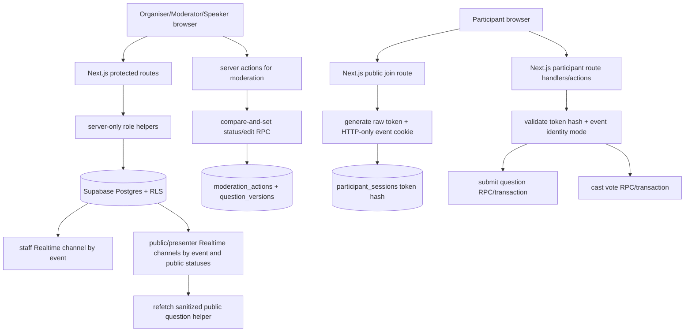

# Phase 2: Live Event Q&A And Moderation - Research

**Researched:** 2026-05-22  
**Domain:** Next.js App Router, Supabase Postgres/RLS/Realtime, live moderated Q&A  
**Confidence:** HIGH

<user_constraints>
## User Constraints (from CONTEXT.md)

### Locked Decisions

#### Reuse Phase 1 Architecture

Phase 2 must extend the existing Next.js App Router structure, protected `(app)` shell, server-action/data-helper pattern, typed Supabase clients, internal Tailwind UI primitives, and Supabase schema. Do not introduce a second auth/session layer, a separate router structure, shadcn, or a new backend framework.

Key Phase 1 contracts to reuse:

- `src/app/(app)/layout.tsx` for authenticated organiser/moderator/speaker shell.
- `src/lib/supabase/server.ts`, `client.ts`, and `admin.ts` for typed Supabase access.
- `src/lib/supabase/rls.ts` role and public question visibility constants.
- `src/lib/events/events.ts` and `src/app/(app)/events/actions.ts` as the event access/action pattern.
- `src/app/(app)/events/[eventId]/page.tsx` as the Phase 2 event workspace entry point.
- `supabase/migrations/202605220101_foundation_schema.sql` as the existing data/RLS foundation.

#### Moderation Visibility Is The Core Safety Rule

Pending, dismissed, and archived questions must never appear in participant-facing or presenter-facing views. Public and presenter surfaces may show only `live` and `answered` questions. Staff moderation surfaces may show pending/dismissed/archived questions only to users whose active event role permits moderation.

Implementation guidance:

- Use server-side role checks before rendering organiser, moderator, and speaker routes.
- Use role-specific data helpers instead of a single generic `select questions` helper.
- Presenter View must query only public statuses even though speakers are event members.
- Participant UI must query only public statuses and must never receive pending question payloads through Realtime.
- Keep the existing moderation-off warning pattern when allowing organisers to disable moderation.

#### Role Access Rules

Organisers can manage event settings, member access, and moderation controls. Moderators can use moderation tools for assigned events only. Speakers can access Presenter View for assigned events only and must not receive moderation controls or private moderation data.

Phase 2 should add explicit helpers for:

- `assertEventRole(userId, eventId, allowedRoles)`.
- `listEventMembersForOrganiser(eventId)`.
- `inviteEventMember(eventId, email, role)`.
- `removeEventMember(eventId, memberId)`.
- `getPresenterEventAccess(userId, eventId)`.
- `getModeratorEventAccess(userId, eventId)`.

If invite email delivery is not yet available, Phase 2 may create pending member records and document manual account onboarding, but it must not imply that external email invitations are delivered unless implemented and tested.

#### Participant Join And Identity

Participants join by code or shared link for active events only. Join must create an event-scoped participant session using `participant_sessions`. Identity rules must follow the event's `identity_mode`:

- `anonymous`: no name or email required.
- `name_required`: display name required.
- `name_email_required`: display name and email required.

Do not trust a client-supplied participant session id by itself. Use a generated session token, store only a hash server-side, and validate the token before accepting question submissions or votes. The browser may keep a participant token in an HTTP-only same-site cookie scoped to the event/join flow.

#### Question Submission Rules

When moderation is enabled, submitted questions enter `pending`. When moderation is disabled, submitted questions may become `live` after rate-limit and duplicate checks.

Submission must enforce:

- Active event only.
- Valid participant session for the event.
- Event character limit.
- Event rate limit in seconds.
- Duplicate block when enabled.
- Required identity mode.

Every accepted question should preserve original text. Moderation edits must create `question_versions` rows.

#### Moderation Actions

Moderation actions must be server-side operations with actor, action, prior/new status, metadata, and timestamp recorded in `moderation_actions`.

Required actions:

- Approve pending question to live.
- Dismiss question to archived.
- Edit question text while preserving versions.
- Archive question.
- Restore archived question to correct prior state.
- Mark live question answered.
- Search and sort moderation queue by recency, age, and votes.
- Toggle moderation off only after warning confirmation.

Use first-action-wins semantics for moderation state changes. If a question has changed since the moderator loaded it, return a clear stale-state error rather than overwriting silently.

#### Audience Q&A And Voting

Participants can see approved live and answered questions only. Participants can sort by Popular or Recent. Participants can upvote a live approved question once per participant session. Use the existing unique vote constraint as the source of truth, and update cached `vote_count` atomically through a database function, trigger, or transaction-safe server path.

#### Presenter View

Presenter View is a staff-facing route for organisers, moderators, and speakers. It shows approved questions only, vote counts, and answered status. It must not show moderation controls, edit controls, submit controls, participant identity management, or private pending/dismissed/archived data.

#### Realtime

Supabase Realtime may be used for normal-condition updates within 2 seconds. Current Supabase docs indicate Postgres Changes subscriptions check RLS policies for subscribed users. Still, Phase 2 must design subscriptions so unsafe payloads are not subscribed to in the first place:

- Moderator channels may subscribe to moderation-safe event question changes after role verification.
- Participant and presenter channels must subscribe only to public `live`/`answered` rows or to sanitized server-provided payloads.
- Do not rely on client-side filtering to hide pending questions.
- Reconnect failure hardening is Phase 4; Phase 2 only needs normal-condition live updates and basic loading/offline states.

### the agent's Discretion

Not specified in `02-CONTEXT.md`. Research recommendations below are limited to implementation choices needed to satisfy the locked Phase 2 decisions. [VERIFIED: .planning/phases/02-live-event-qna-and-moderation/02-CONTEXT.md]

### Deferred Ideas (OUT OF SCOPE)

- Survey creation, results charts, analytics UI, and CSV export are Phase 3.
- Reconnect hardening after prolonged failure is Phase 4.
- Production Coolify deployment and DNS cutover are Phase 4.
- AI features, gamification, downvotes, labels, Excel export, and broad Slido parity extras remain out of v1.
</user_constraints>

## Summary

Phase 2 should extend the existing Next.js 16 App Router and Supabase foundation, not replace it. [VERIFIED: AGENTS.md; VERIFIED: package.json; VERIFIED: .planning/phases/01-foundation-auth-and-data/*SUMMARY.md] The implementation should concentrate authority in server-only data helpers and Postgres functions for participant token validation, question submission, moderation compare-and-set updates, and vote count maintenance. [VERIFIED: supabase/migrations/202605220101_foundation_schema.sql; CITED: https://github.com/vercel/next.js/blob/v16.2.2/docs/01-app/02-guides/data-security.mdx]

The current schema already has the core Phase 2 tables: `event_members`, `participant_sessions`, `questions`, `question_versions`, `question_votes`, and `moderation_actions`. [VERIFIED: supabase/migrations/202605220101_foundation_schema.sql] The main gaps are behavioral, not structural: no app helpers validate participant session tokens, no transactional submission/vote/moderation functions exist, no trigger/RPC maintains `questions.vote_count`, and no Realtime publication entries exist for Q&A tables. [VERIFIED: rg source/schema audit; VERIFIED: supabase/migrations/202605220101_foundation_schema.sql; CITED: https://github.com/supabase/supabase/blob/master/apps/docs/content/guides/realtime/postgres-changes.mdx]

**Primary recommendation:** implement Phase 2 through role-specific server helpers plus a small Supabase migration that adds transactional Q&A RPCs/triggers and Realtime publication entries, while keeping participant/presenter reads restricted to `live` and `answered` at the query and subscription boundary. [VERIFIED: .planning/phases/02-live-event-qna-and-moderation/02-CONTEXT.md; CITED: https://github.com/supabase/supabase/blob/master/apps/www/_blog/2026-05-05-realtime-or-etl-how-to-choose-the-right-tool.mdx]

## Architectural Responsibility Map

| Capability | Primary Tier | Secondary Tier | Rationale |
|------------|--------------|----------------|-----------|
| Staff role access | API / Backend | Database / Storage | Server helpers must assert `event_members` roles before rendering or mutating, while RLS remains the database backstop. [VERIFIED: 02-CONTEXT.md; VERIFIED: supabase/migrations/202605220101_foundation_schema.sql] |
| Participant join/session | API / Backend | Database / Storage | Join needs server-generated raw token cookies and hashed-token persistence in `participant_sessions`. [VERIFIED: 02-CONTEXT.md; VERIFIED: supabase/migrations/202605220101_foundation_schema.sql; CITED: https://github.com/vercel/next.js/blob/v16.2.2/docs/01-app/02-guides/backend-for-frontend.mdx] |
| Question submission | API / Backend | Database / Storage | Validation, duplicate/rate checks, question insert, and version-1 insert should execute server-side in one authoritative path. [VERIFIED: SPEC.md; VERIFIED: supabase/migrations/202605220101_foundation_schema.sql] |
| Moderation actions | API / Backend | Database / Storage | First-action-wins status changes and audit rows require compare-and-set writes and transaction-safe history. [VERIFIED: SPEC.md; VERIFIED: 02-CONTEXT.md] |
| Voting | Database / Storage | API / Backend | The unique vote constraint is already in Postgres, and cached `vote_count` must update atomically with vote insert success. [VERIFIED: supabase/migrations/202605220101_foundation_schema.sql; VERIFIED: 02-CONTEXT.md] |
| Audience and presenter visibility | API / Backend | Browser / Client | Public/presenter loaders and hooks should receive only `live`/`answered` data, with browser sorting/filtering applied only after safe data retrieval. [VERIFIED: 02-CONTEXT.md; VERIFIED: src/lib/supabase/rls.ts] |
| Realtime fanout | Browser / Client | Database / Storage | Client components subscribe to Supabase Realtime channels, but table publication and RLS control what can be broadcast. [CITED: https://github.com/supabase/supabase/blob/master/apps/docs/content/guides/realtime/subscribing-to-database-changes.mdx; CITED: https://github.com/supabase/supabase/blob/master/apps/www/_blog/2026-05-05-realtime-or-etl-how-to-choose-the-right-tool.mdx] |
| Invite/member management | API / Backend | Database / Storage | Organisers mutate `event_members`; email delivery is not available unless a server-only Supabase Admin invite flow is implemented and tested. [VERIFIED: 02-CONTEXT.md; CITED: https://github.com/supabase/supabase/blob/master/apps/www/_blog/2022-08-16-supabase-js-v2.mdx] |

<phase_requirements>
## Phase Requirements

| ID | Description | Research Support |
|----|-------------|------------------|
| AUTH-05 | Organiser can invite and remove Moderator and Speaker access for an event. [VERIFIED: .planning/REQUIREMENTS.md] | Use organiser-only `event_members` helpers and pending member records unless Admin invite email is implemented/tested. [VERIFIED: 02-CONTEXT.md; VERIFIED: supabase/migrations/202605220101_foundation_schema.sql] |
| AUTH-06 | Speaker can access Presenter View for assigned events only. [VERIFIED: .planning/REQUIREMENTS.md] | Add `getPresenterEventAccess` and public-status-only presenter helpers. [VERIFIED: 02-CONTEXT.md; VERIFIED: src/lib/supabase/rls.ts] |
| AUTH-07 | Moderator can access moderation tools for assigned events only. [VERIFIED: .planning/REQUIREMENTS.md] | Add `getModeratorEventAccess`/`assertEventRole` using organiser/moderator roles. [VERIFIED: 02-CONTEXT.md; VERIFIED: supabase/migrations/202605220101_foundation_schema.sql] |
| EVNT-04 | Organiser can edit event settings from the Event Workspace. [VERIFIED: .planning/REQUIREMENTS.md] | Reuse event validation/action pattern and organiser-only event update RLS. [VERIFIED: src/lib/events/validation.ts; VERIFIED: supabase/migrations/202605220101_foundation_schema.sql] |
| EVNT-05 | Organiser can close and archive an event while preserving records. [VERIFIED: .planning/REQUIREMENTS.md] | Use `events.status` values `ended` and `archived`; records cascade only on event delete, not status change. [VERIFIED: supabase/migrations/202605220101_foundation_schema.sql] |
| EVNT-06 | Participant can join an active event by code or shared link. [VERIFIED: .planning/REQUIREMENTS.md] | Resolve `events.join_code` with `status='active'`, then create `participant_sessions`. [VERIFIED: SPEC.md; VERIFIED: supabase/migrations/202605220101_foundation_schema.sql] |
| EVNT-07 | Participant identity mode supports Anonymous, Name required, and Name plus email required. [VERIFIED: .planning/REQUIREMENTS.md] | Enforce existing `identity_mode` enum at join before session creation. [VERIFIED: SRS.md; VERIFIED: src/types/app.ts] |
| QNA-01 | Participant can submit a question to an active event. [VERIFIED: .planning/REQUIREMENTS.md] | Add participant session validation and submission helper. [VERIFIED: 02-CONTEXT.md] |
| QNA-02 | Submitted questions enter Pending when moderation is enabled. [VERIFIED: .planning/REQUIREMENTS.md] | Submission helper chooses `pending` or `live` from `events.moderation_enabled`. [VERIFIED: 02-CONTEXT.md; VERIFIED: supabase/migrations/202605220101_foundation_schema.sql] |
| QNA-03 | Participant-visible and speaker-visible views never show Pending, dismissed, or Archived questions. [VERIFIED: .planning/REQUIREMENTS.md] | Use `PUBLIC_QUESTION_STATUSES` and role-specific helpers. [VERIFIED: src/lib/supabase/rls.ts; VERIFIED: 02-CONTEXT.md] |
| QNA-04 | Moderator can approve a Pending question and move it to Live. [VERIFIED: .planning/REQUIREMENTS.md] | Moderation RPC/action updates `pending -> live` with audit row. [VERIFIED: SPEC.md; VERIFIED: supabase/migrations/202605220101_foundation_schema.sql] |
| QNA-05 | Moderator can dismiss a question and move it to Archived. [VERIFIED: .planning/REQUIREMENTS.md] | Use `moderation_actions.action='dismiss'` and `questions.status='archived'`. [VERIFIED: supabase/migrations/202605220101_foundation_schema.sql] |
| QNA-06 | Moderator can edit question text while preserving original and edited versions. [VERIFIED: .planning/REQUIREMENTS.md] | Write `question_versions` for original and every edit; update `questions.is_edited`. [VERIFIED: SPEC.md; VERIFIED: supabase/migrations/202605220101_foundation_schema.sql] |
| QNA-07 | Moderator can archive and restore questions to the correct prior state. [VERIFIED: .planning/REQUIREMENTS.md] | Use `questions.previous_status` plus archive/restore actions. [VERIFIED: SRS.md; VERIFIED: supabase/migrations/202605220101_foundation_schema.sql] |
| QNA-08 | Moderator can mark a Live question as Answered. [VERIFIED: .planning/REQUIREMENTS.md] | Server-side moderation action changes `live -> answered`. [VERIFIED: SPEC.md; VERIFIED: supabase/migrations/202605220101_foundation_schema.sql] |
| QNA-09 | Moderator can search question text and sort questions by recency, age, or votes. [VERIFIED: .planning/REQUIREMENTS.md] | Query `questions` by event/status with existing submitted/vote indexes. [VERIFIED: supabase/migrations/202605220101_foundation_schema.sql] |
| QNA-10 | Participant can upvote an approved Live question once per session. [VERIFIED: .planning/REQUIREMENTS.md] | Use `question_votes_one_per_session` and only allow `questions.status='live'`. [VERIFIED: supabase/migrations/202605220101_foundation_schema.sql] |
| QNA-11 | Participant can sort approved questions by Popular or Recent. [VERIFIED: .planning/REQUIREMENTS.md] | Public helper orders by `vote_count desc` or `submitted_at desc` over public statuses. [VERIFIED: SPEC.md; VERIFIED: supabase/migrations/202605220101_foundation_schema.sql] |
| QNA-12 | Moderator can turn moderation off only after confirming a warning. [VERIFIED: .planning/REQUIREMENTS.md] | Reuse existing moderation-off warning UI pattern in event settings. [VERIFIED: src/components/events/EventForm.tsx; VERIFIED: tests/e2e/event-dashboard.spec.ts] |
| QNA-13 | System rate-limits participant question submissions according to event settings. [VERIFIED: .planning/REQUIREMENTS.md] | Use `events.question_rate_limit_seconds` in submission helper. [VERIFIED: supabase/migrations/202605220101_foundation_schema.sql] |
| QNA-14 | System blocks duplicate participant question submissions when duplicate block is enabled. [VERIFIED: .planning/REQUIREMENTS.md] | Use `events.duplicate_block_enabled` and normalized participant-submission comparison. [VERIFIED: supabase/migrations/202605220101_foundation_schema.sql; VERIFIED: SPEC.md] |
| QNA-15 | System records moderation actions with actor, action, status change, metadata, and timestamp. [VERIFIED: .planning/REQUIREMENTS.md] | Existing `moderation_actions` columns match the required audit shape. [VERIFIED: supabase/migrations/202605220101_foundation_schema.sql] |
| LIVE-01 | Q&A Moderation updates Pending count and question state changes within 2 seconds. [VERIFIED: .planning/REQUIREMENTS.md] | Add staff Realtime subscriptions after enabling Q&A tables in `supabase_realtime`. [CITED: https://github.com/supabase/supabase/blob/master/apps/docs/content/guides/realtime/postgres-changes.mdx] |
| LIVE-02 | Audience Q&A updates approved questions, vote counts, and answered status within 2 seconds. [VERIFIED: .planning/REQUIREMENTS.md] | Use public-status subscriptions and refetch sanitized lists. [VERIFIED: 02-CONTEXT.md; CITED: https://github.com/supabase/supabase/blob/master/apps/www/_blog/2026-05-05-realtime-or-etl-how-to-choose-the-right-tool.mdx] |
| LIVE-03 | Presenter View shows approved questions, vote counts, and status without moderation controls. [VERIFIED: .planning/REQUIREMENTS.md] | Presenter route uses `PRESENTER_ROLES` for access but `PUBLIC_QUESTION_STATUSES` for data. [VERIFIED: src/lib/supabase/rls.ts; VERIFIED: 02-CONTEXT.md] |
| LIVE-04 | Presenter View updates approved questions, vote changes, and status changes within 2 seconds. [VERIFIED: .planning/REQUIREMENTS.md] | Use same public-status Realtime strategy as audience, but authenticated route access. [VERIFIED: 02-CONTEXT.md] |
</phase_requirements>

## Project Constraints (from AGENTS.md)

- Use the existing Next.js App Router, Tailwind/internal UI primitive, Supabase, and Coolify-oriented stack. [VERIFIED: AGENTS.md]
- Build only from approved URS, PRD, SPEC, and SRS to avoid scope drift. [VERIFIED: AGENTS.md]
- Moderation safety is the primary product constraint; public views must never show pending, dismissed, or archived questions. [VERIFIED: AGENTS.md; VERIFIED: URS.md; VERIFIED: SPEC.md]
- Managed Supabase is approved for v1 Auth, Postgres, Realtime, and data storage. [VERIFIED: AGENTS.md; VERIFIED: SRS.md]
- Core live views must update within 2 seconds in normal conditions. [VERIFIED: AGENTS.md; VERIFIED: SPEC.md; VERIFIED: SRS.md]
- Target WCAG 2.1 AA for core flows and keep audience screens mobile-friendly. [VERIFIED: AGENTS.md; VERIFIED: SPEC.md]
- Avoid packed nested PowerShell command strings; prefer native PowerShell syntax and literal paths. [VERIFIED: AGENTS.md]
- Use Context7 for current library/framework/API documentation lookups. [VERIFIED: AGENTS.md]
- Do not edit source outside a GSD workflow unless explicitly bypassed; this research turn is writing only the Phase 2 research artifact. [VERIFIED: AGENTS.md; VERIFIED: user prompt]

## Standard Stack

### Core

| Library | Installed Version | Current Registry Version | Purpose | Why Standard |
|---------|-------------------|--------------------------|---------|--------------|
| Next.js | 16.2.6 [VERIFIED: npm list] | 16.2.6, modified 2026-05-21 [VERIFIED: npm view next] | App Router pages, route handlers, server actions, protected shell. [VERIFIED: package.json; CITED: /vercel/next.js/v16.2.2] | Existing Phase 1 app and SRS require Next.js App Router. [VERIFIED: SRS.md; VERIFIED: Phase 1 summaries] |
| React | 19.2.6 [VERIFIED: npm list] | 19.2.6, modified 2026-05-08 [VERIFIED: npm view react] | Client components for moderation, audience, presenter, and Realtime hooks. [VERIFIED: package.json] | Required by the existing Next.js app. [VERIFIED: package.json] |
| TypeScript | 5.x range in package.json [VERIFIED: package.json] | Project compiles against generated Supabase types. [VERIFIED: src/lib/supabase/database.types.ts] | Type-safe contracts for tables, enums, helpers, and actions. [VERIFIED: Phase 1 summaries] | Existing code uses TypeScript and generated Supabase `Database` types. [VERIFIED: src/lib/supabase/server.ts] |
| @supabase/supabase-js | 2.106.1 [VERIFIED: npm list] | 2.106.1, modified 2026-05-21 [VERIFIED: npm view @supabase/supabase-js] | Browser/admin Supabase clients and Auth Admin namespace. [VERIFIED: src/lib/supabase/admin.ts; CITED: https://github.com/supabase/supabase/blob/master/apps/www/_blog/2022-08-16-supabase-js-v2.mdx] | Existing typed clients use it directly. [VERIFIED: src/lib/supabase/admin.ts; VERIFIED: src/lib/supabase/client.ts] |
| @supabase/ssr | 0.10.3 [VERIFIED: npm list] | 0.10.3, modified 2026-05-07 [VERIFIED: npm view @supabase/ssr] | Server and browser SSR-compatible Supabase clients. [VERIFIED: src/lib/supabase/server.ts; CITED: https://github.com/supabase/ssr/blob/main/_apirefdocs/api-reference/create-server-client.md] | Existing auth/event paths use `createServerClient`/`createBrowserClient`. [VERIFIED: src/lib/supabase/server.ts; VERIFIED: src/lib/supabase/client.ts] |
| Supabase Postgres/Realtime/Auth | CLI 2.101.0 available [VERIFIED: npx supabase --version] | Managed Supabase approved by SRS. [VERIFIED: SRS.md] | Tables, RLS, Realtime changes, Auth, Admin APIs. [VERIFIED: SRS.md; CITED: Context7 /supabase/supabase] | Phase 1 schema and Supabase clients are already committed. [VERIFIED: Phase 1 summaries] |

### Supporting

| Library/Tool | Installed Version | Purpose | When to Use |
|--------------|-------------------|---------|-------------|
| Vitest | 4.1.7 [VERIFIED: npm list] | Unit/schema/helper tests. [VERIFIED: vitest.config.ts] | Test validation, helper branching, action return states, and migration contract. [VERIFIED: tests/events/events.test.ts; VERIFIED: tests/db/foundation-schema.test.ts] |
| Playwright | 1.60.0 [VERIFIED: npm list] | E2E and mobile smoke tests. [VERIFIED: playwright.config.ts] | Verify join, moderation, presenter, and audience flows including 360px mobile audience screens. [VERIFIED: SPEC.md; VERIFIED: Phase 1 summaries] |
| Docker | 29.4.2 [VERIFIED: docker --version] | Local Supabase services. [VERIFIED: Phase 1 Plan 2 summary] | Use for `npx supabase db reset` and schema/RLS verification. [VERIFIED: Phase 1 Plan 2 summary] |

### Alternatives Considered

| Instead of | Could Use | Tradeoff |
|------------|-----------|----------|
| Supabase Realtime Postgres Changes | Server-Sent Events through Next.js | SSE could sanitize payloads fully but adds a custom live transport outside the approved stack. [VERIFIED: SRS.md; CITED: Supabase Realtime docs] |
| Direct browser writes with participant headers | Next route handlers/server actions | Browser writes would need participant session id/header exposure; server handlers keep raw tokens HTTP-only and validate before database writes. [VERIFIED: 02-CONTEXT.md; CITED: Next.js cookies docs] |
| App-side vote count increments | Postgres trigger/RPC | App-side increments risk race conditions; Postgres unique insert plus trigger/RPC keeps `vote_count` aligned with `question_votes`. [VERIFIED: supabase migration unique constraint; VERIFIED: 02-CONTEXT.md] |

**Installation:** no new runtime libraries are required for Phase 2 if implemented with existing stack. [VERIFIED: package.json; VERIFIED: SRS.md]

```bash
npm install
```

**Version verification:** package versions above were verified with `npm list` and `npm view` on 2026-05-22. [VERIFIED: command output]

## Architecture Patterns

### System Architecture Diagram



### Recommended Project Structure

```text
src/
├── app/
│   ├── (app)/events/[eventId]/        # staff workspace, settings, moderation, presenter links [VERIFIED: existing route]
│   ├── presenter/[eventId]/           # staff presenter route without app-shell controls if full-screen [VERIFIED: SPEC.md]
│   └── join/[joinCode]/               # public participant join and Q&A flow [VERIFIED: SPEC.md]
├── components/
│   ├── events/                        # workspace/settings/member UI [VERIFIED: existing pattern]
│   ├── qna/                           # moderation, audience, presenter Q&A components [VERIFIED: SPEC.md]
│   └── ui/                            # existing primitives only [VERIFIED: Phase 1 summaries]
├── lib/
│   ├── events/                        # existing event helpers and settings updates [VERIFIED: src/lib/events/events.ts]
│   ├── participants/                  # token hashing, cookie names, join/session helpers [VERIFIED: 02-CONTEXT.md]
│   ├── qna/                           # role-specific question helpers and moderation actions [VERIFIED: 02-CONTEXT.md]
│   └── realtime/                      # role-specific channel builders/hooks [CITED: Supabase Realtime docs]
└── types/
    └── app.ts                         # enum unions mirroring Supabase enums [VERIFIED: src/types/app.ts]
```

### Pattern 1: Role-Specific Access Helpers

**What:** add server-only helpers that query `event_members` for exact active roles before loading event screens or performing actions. [VERIFIED: 02-CONTEXT.md; VERIFIED: supabase migration role functions]

**When to use:** every protected event workspace, presenter route, settings action, member action, and moderation action. [VERIFIED: SPEC.md]

**Example:**

```typescript
// Source: existing pattern in src/lib/events/events.ts plus locked Phase 2 helper names.
import "server-only";

export async function assertEventRole(
  userId: string,
  eventId: string,
  allowedRoles: readonly EventRole[],
) {
  const supabase = await createSupabaseServerClient();
  const { data, error } = await supabase
    .from("event_members")
    .select("id, role")
    .eq("event_id", eventId)
    .eq("user_id", userId)
    .eq("status", "active")
    .in("role", [...allowedRoles])
    .maybeSingle();

  if (error || !data) throw new Error("You do not have access to this event.");
  return data;
}
```

### Pattern 2: Server-Only Participant Token Validation

**What:** create a cryptographically random participant token, store only a hash in `participant_sessions`, and set the raw token in an HTTP-only SameSite cookie scoped to the join/event path. [VERIFIED: 02-CONTEXT.md; CITED: Next.js cookies docs]

**When to use:** participant join, question submission, voting, and survey response submission. [VERIFIED: SPEC.md; VERIFIED: SRS.md]

**Example:**

```typescript
// Source: Next.js cookies() route handler capability and Phase 2 participant token decision.
import { cookies } from "next/headers";
import { randomBytes, createHash } from "node:crypto";

export function hashParticipantToken(rawToken: string) {
  return createHash("sha256").update(rawToken).digest("hex");
}

export async function setParticipantCookie(eventId: string, rawToken: string) {
  const cookieStore = await cookies();
  cookieStore.set(`qsb_participant_${eventId}`, rawToken, {
    httpOnly: true,
    sameSite: "lax",
    secure: process.env.NODE_ENV === "production",
    path: `/join`,
  });
}

export function generateParticipantToken() {
  return randomBytes(32).toString("base64url");
}
```

### Pattern 3: Transactional Q&A Database Functions

**What:** add database functions or trigger-backed server paths for operations that must be atomic: submit question with original version, cast vote with cached count, and moderation action with audit row. [VERIFIED: 02-CONTEXT.md; VERIFIED: supabase migration existing tables]

**When to use:** any write that touches more than one table or depends on current status/version. [VERIFIED: SPEC.md]

**Example:**

```sql
-- Source: existing schema tables and Phase 2 first-action-wins requirement.
create or replace function public.increment_question_vote_count()
returns trigger
language plpgsql
as $$
begin
  update public.questions
  set vote_count = vote_count + 1
  where id = new.question_id;
  return new;
end;
$$;

create trigger question_votes_increment_count
after insert on public.question_votes
for each row execute function public.increment_question_vote_count();
```

### Pattern 4: Role-Specific Realtime Channels

**What:** create separate client hooks for moderation, public audience, and presenter subscriptions; never reuse a staff channel in public/presenter surfaces. [VERIFIED: 02-CONTEXT.md; CITED: Supabase Realtime docs]

**When to use:** Phase 2 live update hooks for LIVE-01 to LIVE-04. [VERIFIED: .planning/REQUIREMENTS.md]

**Example:**

```typescript
// Source: Supabase Postgres Changes filter syntax.
const channel = supabase
  .channel(`public-qna:${eventId}`)
  .on(
    "postgres_changes",
    {
      event: "*",
      schema: "public",
      table: "questions",
      filter: `event_id=eq.${eventId}`,
    },
    () => refetchPublicQuestions(),
  )
  .subscribe();
```

**Safety note:** for public/presenter hooks, the callback should treat payloads as invalidation signals and refetch through public-status helpers rather than appending arbitrary payload data to the UI. [VERIFIED: 02-CONTEXT.md; CITED: Supabase Realtime RLS docs]

### Anti-Patterns to Avoid

- **Generic `select questions` helper:** speakers are active event members, and the current member select policy allows active event members to select all event questions, so presenter code must use public-status helpers only. [VERIFIED: 02-CONTEXT.md; VERIFIED: supabase/migrations/202605220101_foundation_schema.sql]
- **Client-side filtering for pending/private rows:** private rows must not be subscribed to or fetched by public/presenter surfaces. [VERIFIED: 02-CONTEXT.md]
- **Raw participant session id trust:** the current RLS helper can read `x-qsb-participant-session-id`, but Phase 2 requires token validation because an id alone is not proof of session control. [VERIFIED: 02-CONTEXT.md; VERIFIED: supabase/migrations/202605220101_foundation_schema.sql]
- **Separate invitation/email claim without tested delivery:** pending `event_members` are acceptable, but UI copy must not say email was sent unless a server-only Admin invite flow is implemented and tested. [VERIFIED: 02-CONTEXT.md; CITED: Supabase Admin docs]
- **Vote count updated after a non-atomic read:** cached counts must be updated in the same database-side path as vote insertion. [VERIFIED: 02-CONTEXT.md; VERIFIED: question_votes unique constraint]

## Don't Hand-Roll

| Problem | Don't Build | Use Instead | Why |
|---------|-------------|-------------|-----|
| Authentication/password reset | Custom password/session store | Existing Supabase Auth flow | Phase 1 already implemented Supabase Auth and lockout guard. [VERIFIED: Phase 1 Plan 3 summary] |
| Role authorization store | Separate app-local ACL | `event_members` plus RLS/helper functions | Schema and policies already model organiser/moderator/speaker access. [VERIFIED: supabase migration] |
| Realtime transport | Custom WebSocket server | Supabase Realtime Postgres Changes | SRS approved Supabase Realtime and docs support table/event filters plus RLS checks. [VERIFIED: SRS.md; CITED: Supabase Realtime docs] |
| CSV/email invite infrastructure in Phase 2 | New mail provider or export system | Pending member records unless Admin invite is tested | Email delivery and CSV export are not required for Phase 2 completion. [VERIFIED: 02-CONTEXT.md; VERIFIED: ROADMAP.md] |
| Vote uniqueness | Client-side disabled button only | `question_votes_one_per_session` unique constraint | Database uniqueness is already present and authoritative. [VERIFIED: supabase migration] |
| Moderation audit log | In-memory history or overwritten text | `moderation_actions` and `question_versions` | Audit/version tables already exist for accountability. [VERIFIED: supabase migration; VERIFIED: SRS.md] |

**Key insight:** the hard parts of Phase 2 are correctness and isolation, not UI state. Put the irreversible decisions in server/database paths and let client components render role-specific projections. [VERIFIED: SPEC.md; VERIFIED: SRS.md]

## Common Pitfalls

### Pitfall 1: Speaker Membership Leaks Pending Questions

**What goes wrong:** presenter code uses the broad event-member question helper and receives pending/archived data. [VERIFIED: 02-CONTEXT.md; VERIFIED: supabase migration]  
**Why it happens:** `questions_select_for_event_members` allows any active event member to select event questions. [VERIFIED: supabase migration]  
**How to avoid:** use `getPresenterQuestions(eventId)` with `status in ('live','answered')` only, even for organiser/moderator presenter access. [VERIFIED: src/lib/supabase/rls.ts; VERIFIED: 02-CONTEXT.md]  
**Warning signs:** presenter tests mock or assert pending question text is absent only through CSS/client filters. [VERIFIED: SPEC.md]

### Pitfall 2: Participant RLS Context Is Treated As Authentication

**What goes wrong:** a client sends a participant session id header and gains access without proving possession of the original token. [VERIFIED: 02-CONTEXT.md; VERIFIED: supabase migration current helper]  
**Why it happens:** current `current_participant_session_id()` can read a request header id, but no helper validates a raw token hash. [VERIFIED: supabase migration; VERIFIED: rg source audit]  
**How to avoid:** validate the HTTP-only raw token server-side against `participant_sessions.session_token_hash` before any submit/vote action. [VERIFIED: 02-CONTEXT.md]  
**Warning signs:** browser code imports participant session ids into local storage or passes `x-qsb-participant-session-id` directly. [VERIFIED: 02-CONTEXT.md]

### Pitfall 3: Realtime Publication Missing

**What goes wrong:** subscriptions are written but no changes arrive. [CITED: Supabase Realtime docs]  
**Why it happens:** Postgres Changes require tables to be added to the `supabase_realtime` publication, and the current migration does not do that. [CITED: Supabase Realtime docs; VERIFIED: rg `alter publication` audit]  
**How to avoid:** add `questions`, `question_votes`, and possibly `moderation_actions` to `supabase_realtime` in a Phase 2 migration. [CITED: Supabase Realtime docs; VERIFIED: Phase 2 requirements]  
**Warning signs:** browser subscription status is subscribed but payload callbacks never fire during local Supabase tests. [CITED: Supabase Realtime docs]

### Pitfall 4: Moderation Race Silently Overwrites State

**What goes wrong:** two moderators act on the same question and the later action overwrites the first without a stale-state message. [VERIFIED: SPEC.md; VERIFIED: 02-CONTEXT.md]  
**Why it happens:** plain `update questions set status=... where id=...` does not compare expected status or `updated_at`. [VERIFIED: codebase has no moderation helper yet]  
**How to avoid:** moderation actions must include expected status or expected `updated_at` in the update condition and return stale-state errors when no row changes. [VERIFIED: 02-CONTEXT.md]  
**Warning signs:** tests only assert final status, not stale-action rejection. [VERIFIED: SPEC.md]

### Pitfall 5: Vote Count Drift

**What goes wrong:** `questions.vote_count` differs from the number of `question_votes` rows. [VERIFIED: 02-CONTEXT.md]  
**Why it happens:** the existing schema has `vote_count` and a unique vote constraint but no trigger/RPC to keep them synchronized. [VERIFIED: supabase migration; VERIFIED: rg source audit]  
**How to avoid:** use database trigger or RPC that increments only after successful unique insert. [VERIFIED: 02-CONTEXT.md]  
**Warning signs:** app code calls `select vote_count`, adds 1 in JavaScript, then updates `questions`. [VERIFIED: 02-CONTEXT.md]

## Code Examples

### Public Question Helper

```typescript
// Source: src/lib/supabase/rls.ts and Phase 2 visibility rule.
export async function listPublicQuestions(eventId: string, sort: "popular" | "recent") {
  const supabase = await createSupabaseServerClient();
  const query = supabase
    .from("questions")
    .select("id,current_text,status,vote_count,is_edited,submitted_at,updated_at")
    .eq("event_id", eventId)
    .in("status", ["live", "answered"]);

  return sort === "popular"
    ? query.order("vote_count", { ascending: false }).order("submitted_at", { ascending: false })
    : query.order("submitted_at", { ascending: false });
}
```

### First-Action-Wins Moderation Update

```typescript
// Source: SPEC concurrent moderation rule and existing Supabase update/select pattern.
const { data, error } = await supabase
  .from("questions")
  .update({ status: "live", previous_status: null })
  .eq("id", questionId)
  .eq("event_id", eventId)
  .eq("status", "pending")
  .eq("updated_at", expectedUpdatedAt)
  .select("id,status,updated_at")
  .maybeSingle();

if (error) throw new Error("Question could not be approved.");
if (!data) throw new Error("This question was updated by another moderator. Refresh and try again.");
```

### Pending Member Record Without Email Claim

```typescript
// Source: event_members schema and Phase 2 invite constraint.
await assertEventRole(userId, eventId, ["organiser"]);

const { error } = await supabase.from("event_members").upsert(
  {
    event_id: eventId,
    invited_email: email.trim().toLowerCase(),
    role,
    status: "invited",
  },
  { onConflict: "event_id,invited_email,role" },
);

if (error) throw new Error("Access could not be saved.");
```

## State of the Art

| Old Approach | Current Approach | When Changed/Verified | Impact |
|--------------|------------------|-----------------------|--------|
| Supabase Realtime without RLS awareness | Realtime checks RLS per subscribed user before sending row changes. [CITED: Supabase Realtime blog/docs] | Verified 2026-05-22 via Context7. [VERIFIED: Context7] | RLS is a defense layer, but QSB Ask should still use role-specific subscriptions and public-status helpers. [VERIFIED: 02-CONTEXT.md] |
| Supabase Auth admin under `auth.api` | Admin methods live under `supabase.auth.admin` and require service role server-side use. [CITED: Supabase JS v2 docs] | Supabase JS v2 docs. [CITED: https://github.com/supabase/supabase/blob/master/apps/www/_blog/2022-08-16-supabase-js-v2.mdx] | Invitation/user creation code must use the server-only admin client, never browser clients. [VERIFIED: src/lib/supabase/admin.ts] |
| Next.js synchronous cookie assumptions | `cookies()` is async and can write only in Server Actions/Route Handlers, not during Server Component render mutations. [CITED: Next.js v16.2.2 docs] | Verified 2026-05-22 via Context7. [VERIFIED: Context7] | Participant token cookies should be set in join route handlers/actions, not in render-only pages. [CITED: Next.js docs] |

**Deprecated/outdated:**
- Next.js middleware convention shows a deprecation warning in Phase 1, but current source still uses `src/middleware.ts` and migration to `proxy` is outside Phase 2 unless it blocks routing. [VERIFIED: Phase 1 Plan 3 summary; VERIFIED: src/middleware.ts]

## Assumptions Log

| # | Claim | Section | Risk if Wrong |
|---|-------|---------|---------------|
| - | None. | - | All implementation claims in this research are tagged as verified or cited. |

## Open Questions

1. **Should Phase 2 implement real email invitations or pending records only?**
   - What we know: pending `event_members` records are explicitly acceptable if email delivery is not available. [VERIFIED: 02-CONTEXT.md]
   - What's unclear: no tested Supabase Admin invite/create flow exists in current source. [VERIFIED: rg source audit]
   - Recommendation: plan pending records and manual onboarding for Phase 2; add Admin invite only as a separately tested enhancement. [CITED: Supabase Admin docs; VERIFIED: 02-CONTEXT.md]

2. **Should participant mutations use Supabase RLS headers or service-role server helpers?**
   - What we know: raw token validation must happen before submissions/votes, and service-role clients must remain server-only. [VERIFIED: 02-CONTEXT.md; VERIFIED: src/lib/supabase/admin.ts]
   - What's unclear: no current helper exists to bind participant token proof into PostgREST RLS context. [VERIFIED: rg source audit]
   - Recommendation: use Next route handlers/server actions to validate token hash, then call transaction-safe database functions from server-only code. [VERIFIED: 02-CONTEXT.md; CITED: Next.js cookies docs]

## Environment Availability

| Dependency | Required By | Available | Version | Fallback |
|------------|-------------|-----------|---------|----------|
| Node.js | Next.js app/test runtime | yes [VERIFIED: node --version] | 24.11.1 [VERIFIED: node --version] | none needed |
| npm | package scripts/version checks | yes [VERIFIED: npm --version] | 11.6.2 [VERIFIED: npm --version] | none needed |
| Supabase CLI | local db reset/types/migrations | yes [VERIFIED: npx supabase --version] | 2.101.0 [VERIFIED: npx supabase --version] | managed Supabase project verification if local CLI unavailable |
| Docker | local Supabase services | yes [VERIFIED: docker --version] | 29.4.2 [VERIFIED: docker --version] | managed Supabase project verification if Docker unavailable |
| Managed Supabase project env vars | real auth/realtime/manual UAT | not configured in repo [VERIFIED: .env.example placeholders] | - | local mocked/unit tests and local Supabase CLI |

**Missing dependencies with no fallback:** none for research and planning. [VERIFIED: environment audit]

**Missing dependencies with fallback:** real managed Supabase credentials are not in the repo, so Phase 2 plans should keep local/unit/E2E fixture tests and reserve production invite/email verification for a configured environment. [VERIFIED: .env.example; VERIFIED: Phase 1 verification residual risk]

## Validation Architecture

### Test Framework

| Property | Value |
|----------|-------|
| Framework | Vitest 4.1.7 and Playwright 1.60.0 [VERIFIED: npm list] |
| Config file | `vitest.config.ts`, `playwright.config.ts` [VERIFIED: rg --files] |
| Quick run command | `npm run test -- tests/qna/qna.test.ts` [VERIFIED: package.json test script] |
| Full suite command | `npm run lint && npm run test && npm run test:e2e -- tests/e2e/qna.spec.ts` [VERIFIED: package.json scripts] |

### Phase Requirements -> Test Map

| Req ID | Behavior | Test Type | Automated Command | File Exists? |
|--------|----------|-----------|-------------------|--------------|
| AUTH-05/06/07 | role access for organiser/moderator/speaker | unit + e2e | `npm run test -- tests/qna/access.test.ts` | no - Wave 0 |
| EVNT-04/05 | event settings close/archive/edit | unit + e2e | `npm run test -- tests/events/event-settings.test.ts` | no - Wave 0 |
| EVNT-06/07 | participant join and identity modes | unit + e2e | `npm run test -- tests/qna/participant-session.test.ts` | no - Wave 0 |
| QNA-01/02/13/14 | submission, moderation default, rate limit, duplicate block | unit + e2e | `npm run test -- tests/qna/submission.test.ts` | no - Wave 0 |
| QNA-03/LIVE-02/LIVE-04 | public/presenter visibility and realtime refresh | e2e | `npm run test:e2e -- tests/e2e/qna.spec.ts` | no - Wave 0 |
| QNA-04 to QNA-09/QNA-15 | moderation actions/search/sort/audit | unit + e2e | `npm run test -- tests/qna/moderation.test.ts` | no - Wave 0 |
| QNA-10/11 | one vote per session and sorting | unit + e2e | `npm run test -- tests/qna/voting.test.ts` | no - Wave 0 |
| LIVE-01 to LIVE-04 | normal-condition updates within 2 seconds | e2e/integration | `npm run test:e2e -- tests/e2e/qna-realtime.spec.ts` | no - Wave 0 |

### Sampling Rate

- **Per task commit:** run the focused Vitest file for the helper/action being changed. [VERIFIED: existing Phase 1 TDD pattern]
- **Per wave merge:** run `npm run lint && npm run test`. [VERIFIED: Phase 1 verification pattern]
- **Phase gate:** run full unit suite plus Phase 2 Playwright specs, including mobile 360px audience checks. [VERIFIED: SPEC.md; VERIFIED: Phase 1 summaries]

### Wave 0 Gaps

- [ ] `tests/qna/access.test.ts` - role helper and member invite/remove coverage. [VERIFIED: no existing file via rg]
- [ ] `tests/qna/participant-session.test.ts` - token hashing, cookie scoping, identity modes. [VERIFIED: no existing file via rg]
- [ ] `tests/qna/submission.test.ts` - active event, rate limit, duplicate block, original version. [VERIFIED: no existing file via rg]
- [ ] `tests/qna/moderation.test.ts` - compare-and-set status actions, edit versions, audit rows. [VERIFIED: no existing file via rg]
- [ ] `tests/qna/voting.test.ts` - unique vote and `vote_count` maintenance. [VERIFIED: no existing file via rg]
- [ ] `tests/e2e/qna.spec.ts` - join, audience, moderation, presenter happy path. [VERIFIED: no existing file via rg]
- [ ] `tests/e2e/qna-realtime.spec.ts` - normal-condition update checks within 2 seconds. [VERIFIED: no existing file via rg]

## Security Domain

### Applicable ASVS Categories

| ASVS Category | Applies | Standard Control |
|---------------|---------|------------------|
| V2 Authentication | yes | Supabase Auth for staff; participant raw token stored only in HTTP-only cookie and hashed in DB. [VERIFIED: Phase 1 auth summaries; VERIFIED: 02-CONTEXT.md] |
| V3 Session Management | yes | Supabase SSR cookies for staff; event-scoped participant token cookies for audience. [VERIFIED: src/lib/supabase/server.ts; CITED: Next.js cookies docs] |
| V4 Access Control | yes | Server role helpers plus Supabase RLS policies. [VERIFIED: supabase migration; VERIFIED: 02-CONTEXT.md] |
| V5 Input Validation | yes | Server-side validators for event settings, join identity, question text, moderation actions, and sort/search inputs. [VERIFIED: src/lib/events/validation.ts; VERIFIED: SPEC.md] |
| V6 Cryptography | yes | Node `crypto`/Web Crypto hashing and random token generation; do not hand-roll cryptography. [VERIFIED: 02-CONTEXT.md] |
| V7 Error Handling | yes | Stale moderation and validation errors must be explicit without leaking private data. [VERIFIED: SPEC.md] |
| V8 Data Protection | yes | Public/presenter data projections exclude pending/archived/private moderation fields. [VERIFIED: 02-CONTEXT.md; VERIFIED: SRS.md] |

### Known Threat Patterns for Next.js + Supabase Q&A

| Pattern | STRIDE | Standard Mitigation |
|---------|--------|---------------------|
| Pending question leak through presenter/member queries | Information Disclosure | Public-status-only presenter helpers and role-specific Realtime hooks. [VERIFIED: 02-CONTEXT.md; VERIFIED: supabase migration] |
| Participant session fixation/guessing | Spoofing | Generate high-entropy token, store hash only, validate token before writes. [VERIFIED: 02-CONTEXT.md] |
| Vote stuffing by repeated requests | Tampering | Unique `(question_id, participant_session_id)` plus server token validation. [VERIFIED: supabase migration; VERIFIED: 02-CONTEXT.md] |
| Moderation action race | Tampering/Repudiation | Compare-and-set update plus `moderation_actions` row. [VERIFIED: SPEC.md; VERIFIED: supabase migration] |
| Service role exposure | Elevation of Privilege | Keep Admin client in `server-only` module and never import it from client components. [VERIFIED: src/lib/supabase/admin.ts; CITED: Supabase Admin docs] |
| Realtime private payload reuse | Information Disclosure | Separate staff, public, and presenter channels; public/presenter callbacks refetch sanitized lists. [VERIFIED: 02-CONTEXT.md; CITED: Supabase Realtime docs] |

## Sources

### Primary (HIGH confidence)

- `.planning/phases/02-live-event-qna-and-moderation/02-CONTEXT.md` - locked Phase 2 decisions, risks, and out-of-scope boundaries. [VERIFIED]
- `URS.md`, `PRD.md`, `SPEC.md`, `SRS.md` - approved product/functional/system requirements. [VERIFIED]
- `.planning/REQUIREMENTS.md`, `.planning/ROADMAP.md` - Phase 2 requirement IDs and success criteria. [VERIFIED]
- Phase 1 summaries and `VERIFICATION.md` - existing app/schema/test contracts and residual risks. [VERIFIED]
- `supabase/migrations/202605220101_foundation_schema.sql` - current schema, indexes, RLS, helper functions. [VERIFIED]
- `src/lib/supabase/*`, `src/lib/events/*`, `src/app/(app)/events/*` - existing helper/action/client patterns. [VERIFIED]
- Context7 `/supabase/supabase` - Realtime Postgres Changes, RLS behavior, publication setup, Auth Admin methods. [CITED]
- Context7 `/supabase/ssr` - `createServerClient` cookie handling. [CITED]
- Context7 `/vercel/next.js/v16.2.2` - server actions, route handlers, async cookies, mutation placement. [CITED]

### Secondary (MEDIUM confidence)

- npm registry version checks for Next.js, React, Supabase JS/SSR, Vitest, Playwright. [VERIFIED: npm view]
- local environment probes for Node, npm, Supabase CLI, Docker. [VERIFIED: shell commands]

### Tertiary (LOW confidence)

- None.

## Metadata

**Confidence breakdown:**
- Standard stack: HIGH - existing package installs and npm registry versions were verified. [VERIFIED: npm list; VERIFIED: npm view]
- Architecture: HIGH - locked by Phase 2 context and Phase 1 source/schema patterns. [VERIFIED: 02-CONTEXT.md; VERIFIED: source audit]
- Pitfalls: HIGH - each pitfall maps to a documented requirement, current schema gap, or official Supabase/Next behavior. [VERIFIED: SPEC.md; VERIFIED: supabase migration; CITED: Context7 docs]

**Research date:** 2026-05-22  
**Valid until:** 2026-06-21 for codebase-specific guidance; 2026-05-29 for package/doc currency. [VERIFIED: current date; VERIFIED: fast-moving framework ecosystem]
