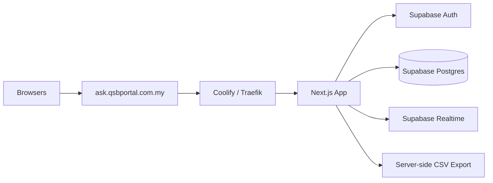

# Architecture Research: QSB Ask

## Architecture Shape

QSB Ask should be built as a single Next.js application deployed through Coolify. Managed Supabase provides backend services for v1.

## Core Data Boundaries

- Signed-in users are managed by Supabase Auth.
- Application profiles and event roles live in app tables.
- Participants use event-scoped sessions, not full accounts.
- Questions store status and current text.
- Question versions preserve original and edited text.
- Moderation actions preserve accountability.
- Survey answers are separated from survey questions/options for export and analytics.

## Real-Time Design

Use Supabase Realtime subscriptions by event id and survey id. Realtime pushes changes; all writes still go through server-side validation and role checks.

Views requiring live updates:

- Q&A Moderation.
- Audience Q&A.
- Presenter View.
- Presentation View.
- Survey Results Dashboard.

## Deployment Design

- Coolify resource for the Next.js app.
- Coolify environment variables for Supabase URL and keys.
- Health route for deployment verification.
- Cloudflare DNS to `ask.qsbportal.com.my`.
- No ad hoc long-running Docker service outside Coolify.

