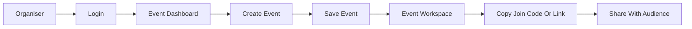
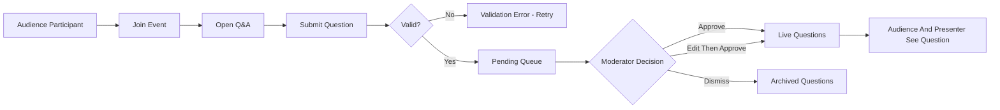
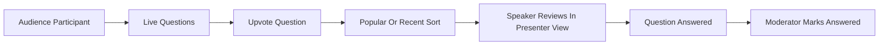
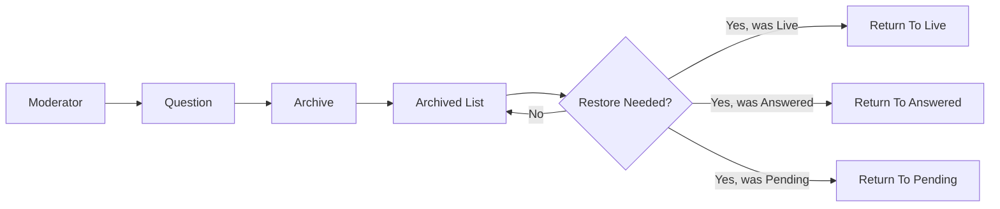
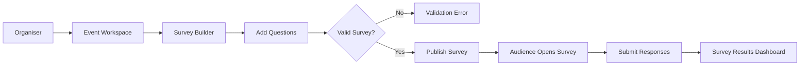
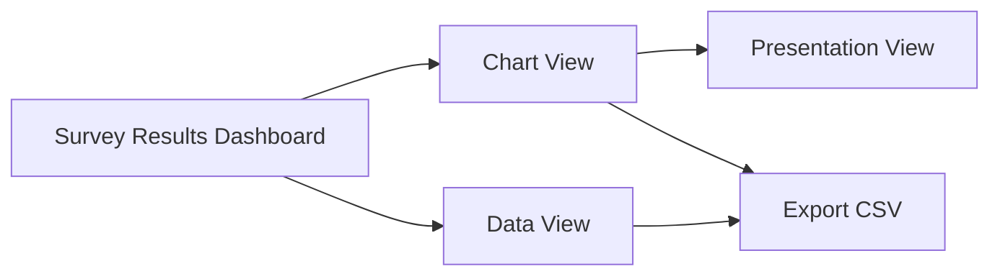

# QSB Ask - Functional Specification

Version: 1.0
Date: 22 May 2026
Status: Approved
Source: Approved URS v1.0 and PRD v1.1
Changes from v0.1: Added Presenter View, Settings, real-time behaviour, data limits, login detail, edit history rules, multi-moderator handling, search behaviour, and tightened accessibility. Resolved Review Questions 1-5.

## 1. Screen Inventory

QSB Ask has four main user experiences:

- Organiser and moderator experience for managing events, Q&A, surveys, results, settings, and exports.
- Speaker experience for viewing approved questions during a session.
- Audience experience for joining an event, submitting questions, voting, and answering surveys.
- Presentation experience for showing survey results on a shared screen.

### 1.1 Login

Entry screen for organisers, moderators, speakers, and administrators.

### 1.2 Event Dashboard

List of events available to the signed-in user. Users can create a new event, open an existing event, search events, and review basic event status.

### 1.3 Create/Edit Event

Form for setting up or updating an event, including event name, date, audience access, participant identity setting, and moderation setting.

### 1.4 Event Workspace

Main organiser and moderator workspace for a selected event. It contains:

- Q&A
- Surveys
- Results
- Settings
- Exports

### 1.5 Q&A Moderation

Workspace area for managing submitted questions. It uses four states: Pending, Live, Answered, Archived.

### 1.6 Survey Builder

Workspace area for creating and editing surveys. Supports multiple choice, multiple select, rating, and open text questions.

### 1.7 Survey Results Dashboard

Workspace area for viewing survey response counts, charts, data views, and export actions.

### 1.8 Event Settings

Workspace area for editing event details, managing access roles, setting question rules, and closing the event.

### 1.9 Presenter View

Dedicated speaker screen showing approved questions, vote counts, and answered status. No moderation controls.

### 1.10 Presentation View

Clean screen-sharing view for survey results. Hides admin controls. Used for projecting results to the room.

### 1.11 Audience Join

Public entry screen where participants join an event by code or link.

### 1.12 Audience Q&A

Audience screen for submitting questions, seeing approved questions, upvoting, and sorting by popular or recent.

### 1.13 Audience Survey

Audience screen for completing active surveys.

### 1.14 Export / Event History

Workspace area for exporting questions, moderation records, and survey responses.

## 2. User Flows

### 2.1 Event Creation And Sharing

### 2.2 Moderated Q&A Submission

### 2.3 Question Voting And Answering

### 2.4 Question Archive And Restore

### 2.5 Survey Creation And Response

### 2.6 Survey Results Presentation And Export

## 3. Screen Specifications

### 3.1 Login

#### Purpose

Allow authorised users to access event management features.

#### Elements

- Product name and logo.
- Email field.
- Password field.
- Sign in action.
- Forgot password link.
- Error message area.

#### Interactions

- User enters email and password and signs in.
- Successful login opens the Event Dashboard.
- Failed login shows a clear error and keeps the user on the login screen.
- Forgot password opens a password reset flow that sends a reset link to the registered email.
- Session expires after 8 hours of inactivity and returns the user to Login.

#### States

- Empty.
- Loading.
- Error (invalid credentials, locked account, server unavailable).
- Authenticated.
- Password reset requested.

#### Rules

- Five failed sign-in attempts within 15 minutes locks the account for 30 minutes.
- Passwords must meet minimum standards: 12 characters, mixed case, number, symbol.

### 3.2 Event Dashboard

#### Purpose

Help signed-in users find, create, and open events.

#### Elements

- Event list with name, date, status, join code.
- Create event action.
- Search field.
- Quick copy action for join code or link.

#### Interactions

- Create event opens Create/Edit Event.
- Selecting an event opens Event Workspace.
- Search filters the visible event list by event name and join code, case-insensitive, live filter.
- Copy action copies the event join code or link to the clipboard.

#### States

- No events.
- Events available.
- Search with no results.
- Loading.
- Error loading events.

### 3.3 Create/Edit Event

#### Purpose

Allow organisers to configure the event before sharing it with participants.

#### Elements

- Event name.
- Event date or date range.
- Event time zone.
- Event status (draft, active, ended).
- Participant identity setting:
  - Anonymous allowed.
  - Name required.
  - Name and email required.
- Moderation setting, enabled by default.
- Save action.
- Cancel action.

#### Interactions

- Saving creates or updates the event.
- Cancel returns to the previous screen without saving.
- Moderation is enabled by default and is visibly marked as the recommended setting.
- Turning moderation off shows a warning dialog explaining that audience questions will appear publicly without review. The organiser must confirm to proceed.

#### States

- New event.
- Existing event.
- Unsaved changes.
- Validation error.
- Save success.
- Save failure.
- Moderation-off warning shown.

#### Rules

- Event name is required.
- Event date is required and must be today or later.
- Time zone defaults to the organiser's local time zone.

### 3.4 Event Workspace

#### Purpose

Provide one central workspace for managing the event.

#### Elements

- Event name.
- Join code and link.
- Workspace navigation:
  - Q&A
  - Surveys
  - Results
  - Settings
  - Exports
- Event status indicator (draft, active, ended).
- Presenter View action.
- Presentation View action.

#### Interactions

- User switches between workspace areas without leaving the selected event.
- Copy join link action copies participant access details.
- Presenter View action opens the speaker screen in a new window.
- Presentation View action opens the survey results display in a new window.

#### States

- Event not yet active.
- Event active.
- Event ended.
- Loading workspace.
- Error loading event.

### 3.5 Q&A Moderation

#### Purpose

Allow moderators to manage questions safely and quickly during a live session.

#### Elements

- Question status tabs: Pending, Live, Answered, Archived.
- Search field (searches question text only, case-insensitive, live filter).
- Sort control (most recent, oldest, most votes).
- Question cards with:
  - Question text.
  - Participant identity (or Anonymous).
  - Submitted time.
  - Vote count.
  - Current status.
  - Edited indicator if applicable.
  - Moderation actions.
- Empty state for each tab.
- Real-time indicator showing new pending count.

#### Interactions

Pending questions:

- Approve moves the question to Live.
- Dismiss moves the question to Archived.
- Edit opens editable question text.
- Archive moves the question to Archived.

Live questions:

- Mark answered moves the question to Answered.
- Edit updates question text.
- Archive moves the question to Archived.

Answered questions:

- Restore moves the question back to Live.
- Archive moves the question to Archived.

Archived questions:

- Restore moves the question back to its previous state (Pending, Live, or Answered).

#### States

- Pending.
- Live.
- Answered.
- Archived.
- Editing.
- Empty queue.
- Action success.
- Action failure.
- Concurrent edit detected.

#### Rules

- No pending question appears in Audience Q&A, Presenter View, or Presentation View.
- A dismissed question is not publicly visible.
- Archived questions are retained for records and exports.
- Every moderator edit is recorded as a separate version: original text, edited text, moderator identity, and timestamp. The original is never overwritten.
- A restored archived question that was never approved returns to Pending, not Live.
- If two moderators open the same question for action, the first action wins. The second moderator sees a "this question was just updated by [name]" notice and the refreshed state. No locking.
- Pending count and question lists update live for all moderators within 2 seconds of any change.

### 3.6 Survey Builder

#### Purpose

Allow organisers to create practical surveys for live or post-session feedback.

#### Elements

- Survey title.
- Survey status (draft, published, closed).
- Question list.
- Add question action.
- Question type selector:
  - Multiple choice.
  - Multiple select.
  - Rating.
  - Open text.
- Question text.
- Answer options where applicable.
- Result visibility toggle (hidden from participants by default, can be set to visible per survey).
- Publish action.
- Save draft action.

#### Interactions

- Add question appends a new survey question.
- Edit question updates question content.
- Remove question deletes the question before publishing.
- Publish makes the survey available to participants.
- Save draft keeps the survey hidden from participants.
- Result visibility toggle controls whether the Audience Survey screen shows results after submission.

#### States

- Empty survey.
- Draft survey.
- Published survey.
- Closed survey.
- Validation error.
- Save failure.

#### Rules

- A survey must have at least one question before publishing.
- Multiple choice questions require at least two options.
- Multiple select questions require at least two options.
- Rating questions require a defined rating scale (1-5 or 1-10).
- Open text questions require question text.
- Result visibility defaults to hidden from participants.

### 3.7 Survey Results Dashboard

#### Purpose

Allow organisers to review survey results visually and as data.

#### Elements

- Survey selector.
- Response count.
- Question-by-question result sections.
- Chart view for choice and rating questions.
- Data view for open text responses.
- Export action.
- Presentation view action.

#### Interactions

- Selecting a survey loads its results.
- User switches between chart and data views where supported.
- Export downloads survey results as CSV.
- Presentation view opens a screen-sharing result view.
- Response counts update live as new responses arrive (within 2 seconds).

#### States

- No responses yet.
- Responses available.
- Partial responses.
- Export loading.
- Export success.
- Export failure.

#### Rules

- Multiple choice results show option counts and percentages.
- Multiple select results show option counts and percentages.
- Rating results show count distribution and average rating.
- Open text results show individual responses in a readable list.

### 3.8 Event Settings

#### Purpose

Let organisers manage event configuration, access, content rules, and lifecycle.

#### Elements

- Event details section:
  - Same fields as Create/Edit Event (name, date, time zone, identity setting, moderation toggle).
- Access roles section:
  - List of people with access by role.
  - Roles: Organiser, Moderator, Speaker.
  - Invite person action (email-based invite).
  - Remove person action.
- Question rules section:
  - Question character limit (default 280, configurable 50-1000).
  - Duplicate submission block (on by default).
  - Submission rate limit (default: 1 question per 30 seconds per participant).
- Event lifecycle section:
  - Close event action (stops new submissions, preserves records).
  - Archive event action (removes from active list, preserves records).

#### Interactions

- Edits to event details save with a confirmation.
- Inviting a person sends an email with a sign-in link and assigned role.
- Removing a person revokes their access immediately.
- Closing the event prevents new submissions and survey responses but keeps records visible.
- Archiving moves the event off the main Dashboard into an Archived view.

#### States

- Active settings.
- Saving.
- Save success.
- Save failure.
- Invite sent.
- Invite failed.
- Event closed.
- Event archived.

#### Rules

- Only Organisers can change Settings.
- The original event creator cannot be removed by another Organiser.
- Closing an event is reversible; archiving is reversible but hides the event from the default Dashboard.

### 3.9 Presenter View

#### Purpose

Give speakers a focused screen for answering approved questions during a live session.

#### Elements

- Event name.
- Approved question list (Live status only).
- Vote count per question.
- Question status indicator (Live or Answered).
- Sort control (most votes, most recent).
- Highlight indicator for the question currently being answered, if set by a moderator.
- Minimal navigation. No moderation actions.

#### Interactions

- Speaker views approved questions and refers to them while presenting.
- List updates live within 2 seconds when new questions are approved, votes change, or status changes.
- Speaker can mark a question as the current one being answered (visual highlight only, does not change status). This highlight is visible to moderators but not to the audience.

#### States

- No approved questions.
- Approved questions available.
- Connection lost (shows reconnect indicator, retries automatically).

#### Rules

- No pending, dismissed, or archived questions are shown.
- No moderation controls are shown.
- The screen layout uses large readable text for use on a second monitor or laptop near the podium.

### 3.10 Presentation View

#### Purpose

Show survey results cleanly on a shared screen during or after a session.

#### Elements

- Event name.
- Active survey selector (if more than one survey is open).
- Question-by-question chart view.
- Response count.
- Large readable content. No admin controls.

#### Interactions

- Organiser or operator selects which survey to display.
- Charts update live within 2 seconds as new responses arrive.

#### States

- Survey results available.
- No survey responses yet.
- No surveys published.
- Connection lost (shows reconnect indicator, retries automatically).

#### Rules

- Only published surveys are shown.
- No admin controls are visible.
- Layout uses large text sized for projection.

### 3.11 Audience Join

#### Purpose

Allow participants to enter an event quickly.

#### Elements

- Event code input.
- Join action.
- Event name after successful join.
- Identity fields appear here if the event requires name or name and email.
- Error message area.

#### Interactions

- User enters a code and joins the event.
- Shared links pre-fill the code and skip manual entry.
- Invalid code shows a clear error.

#### States

- Empty.
- Joining.
- Invalid code.
- Event not active.
- Identity required.
- Joined.

### 3.12 Audience Q&A

#### Purpose

Allow participants to submit questions and engage with approved questions.

#### Elements

- Event name.
- Q&A tab.
- Survey tab (shown only when a survey is active).
- Question input with character count.
- Submit question action.
- Approved question list.
- Popular and recent sort controls.
- Upvote action per question.
- Answered status label.

#### Interactions

- Submit sends the question to the moderation queue.
- If moderation is enabled, the participant sees a "waiting for review" confirmation.
- If moderation is off, the question appears in the live list immediately.
- Upvote increases the vote count on an approved question.
- Sort changes question order (popular: by vote count desc; recent: by submission time desc).
- Approved questions, vote counts, and answered status update live within 2 seconds.

#### States

- No approved questions.
- Approved questions available.
- Question submitted and pending review.
- Question submitted and live (moderation off).
- Submission error.
- Rate-limited (recently submitted, must wait).
- Event closed.

#### Rules

- Participants cannot see pending or dismissed questions.
- Participants cannot approve, edit, dismiss, or archive questions.
- Participants can only upvote approved Live questions.
- A participant can upvote a given question only once per session.
- A participant can submit one question per 30 seconds by default (configurable in Settings).

### 3.13 Audience Survey

#### Purpose

Allow participants to answer active surveys easily.

#### Elements

- Survey title.
- Question list.
- Answer controls by question type.
- Submit response action.
- Completion message.
- Results view (shown only if the survey's result visibility is set to visible).

#### Interactions

- Participant answers questions and submits.
- Successful submission shows a confirmation.
- Validation errors identify questions that need attention.
- If results are visible to participants, the results view appears after submission.

#### States

- No active survey.
- Survey active.
- Partially answered.
- Submitted.
- Submission error.
- Survey closed.
- Results visible to participant.

#### Rules

- A participant can submit a survey only once per session.
- Results are hidden from participants unless the organiser has enabled visibility for that survey.

### 3.14 Export / Event History

#### Purpose

Allow organisers and administrators to retrieve event records.

#### Elements

- Export categories:
  - Questions (all states, including original and edited text).
  - Moderation records (action, moderator, timestamp).
  - Survey responses (per survey).
- Format: CSV.
- Download action.
- Event history summary (counts of questions, responses, moderation actions).

#### Interactions

- User selects export category.
- Download action generates a CSV and downloads it to the user's device.

#### States

- No records.
- Records available.
- Export loading.
- Export success.
- Export failure.

#### Rules

- Exports include all moderation history (original text, edits, status changes).
- Anonymous participants appear as "Anonymous" with a per-session identifier so vote uniqueness can be audited without exposing identity.

## 4. Real-Time Behaviour

QSB Ask is a live event tool. The following views update within 2 seconds of any underlying change, without manual refresh:

- Q&A Moderation (Pending count, all status tabs).
- Audience Q&A (approved question list, vote counts, answered status).
- Presenter View (approved questions, votes, status, highlight).
- Presentation View (survey response counts and charts).
- Survey Results Dashboard (response counts and charts).

Failure modes:

- If the connection drops, the affected screen shows a reconnect indicator and retries automatically.
- Moderator actions taken offline are not supported in V1: the action is rejected with a "reconnect to continue" message.
- When two moderators act on the same question, the first action wins. The second moderator's screen refreshes and shows a notice.

The transport choice (WebSocket, Server-Sent Events, or polling) is an SRS decision, not a SPEC decision. The SPEC commits only to the 2-second target and the failure behaviour above.

## 5. Data Limits And Defaults

| Item | Default | Range |
|---|---|---|
| Question character limit | 280 | 50-1000 |
| Question submission rate per participant | 1 per 30 seconds | 1 per 5-300 seconds |
| Duplicate question block | On | On / Off |
| Upvotes per participant per question | 1 | Fixed |
| Survey questions per survey | No limit in V1 | - |
| Survey options per choice question | 2-10 | 2-20 |
| Rating scale | 1-5 | 1-5 or 1-10 |
| Session inactivity timeout (organiser) | 8 hours | - |
| Account lockout after failed sign-ins | 5 attempts / 15 min, lock 30 min | - |

## 6. Edge Cases And Error Handling

### Event Access

- Invalid join code shows an error and allows retry.
- Closed event shows a clear closed-event message and prevents submissions.
- Deleted or unavailable event shows a not-found message.
- The audience join URL does not expose organiser controls.

### Question Submission

- Empty question cannot be submitted.
- Question above the configured character limit cannot be submitted; the character count turns red as the user approaches the limit.
- Duplicate question submissions are blocked when duplicate-block is on (case-insensitive match against the participant's own submissions in the same event).
- Rate-limited submissions show a countdown to the next allowed submission.
- Network failure during submission shows a retry option and preserves the entered text.
- If moderation is enabled, submitted questions must not appear publicly until approved.

### Moderation

- If two moderators act on the same question, the first action wins; the second sees an updated state notice.
- A failed moderation action leaves the question in its last confirmed state.
- Edited questions preserve full version history.
- A restored archived question returns to its prior state (Pending, Live, or Answered). It does not skip Pending if it was never approved.

### Voting

- A participant can upvote the same question only once per session.
- Archived or answered questions cannot receive new votes unless restored to Live.
- Vote counts update live for all viewers within 2 seconds.

### Surveys

- A survey cannot be published without valid questions.
- A closed survey cannot accept new responses; participants see a closed-survey message.
- A participant can submit a survey only once per session.
- Open text responses display in a scrollable list in the results dashboard.
- Charts handle zero responses with a clear empty-state.

### Exports

- An export with no records shows a clear empty-state message rather than downloading an empty file.
- Export failure shows a retry option.
- Exported records match the event's stored questions, survey responses, and moderation history at the time of export.

### Real-Time

- A dropped connection shows a reconnect indicator; the user is not signed out.
- If reconnection fails for more than 30 seconds, the user is prompted to refresh.

## 7. Accessibility And Constraints

- Target: WCAG 2.1 Level AA.
- Audience screens must work on mobile (iOS Safari, Android Chrome, latest two versions).
- Organiser and moderator screens must work on desktop (Chrome, Edge, Firefox, Safari, latest two versions).
- All buttons and controls must have clear text labels. Icon-only buttons must have accessible names.
- Question status must be conveyed through text and shape, not colour alone.
- Charts must include readable labels, values, and an accessible data table alternative.
- Presentation View and Presenter View must use large text suitable for projection or a second monitor.
- Keyboard navigation must support all organiser and moderator actions, including tab order, focus indicators, and Enter/Space activation.
- Error messages must explain what happened and what the user can do next.
- The product must avoid clutter and keep each user focused on their role.
- Language: English in V1. Localisation is out of scope for V1.

## 8. SRS Handoff

The following SRS-level decisions were intentionally left out of the SPEC and are now addressed in SRS v1.0:

- Real-time transport (WebSocket, SSE, or polling).
- Hosting environment and database choice.
- Authentication storage (password hashing, reset token mechanism).
- Email service for invites and password resets.
- Data retention policy and backup approach.
- Performance targets (concurrent users per event, peak submission rate).

## 9. Resolved Review Questions

The following were open in v0.1 and are now resolved:

1. Presenter View is included in V1 as a dedicated screen (3.9). Presentation View (3.10) is for survey results only.
2. Survey results are organiser-controlled per survey, hidden from participants by default.
3. Moderation is on by default but can be turned off with a confirmation warning.
4. Exports are CSV only in V1.
5. Participant identity options are Anonymous, Name only, and Name plus email.

## 10. PRD Alignment

The following decisions in this SPEC promoted items that were P1 or unspecified in PRD v1.0:

- Presenter View (PRD P1-03) is promoted to V1 / P0.
- Survey result sharing toggle (PRD P1-06) is promoted to V1 / P0.
- Basic access roles (PRD P1-07) are promoted to V1 / P0 to support the Settings screen.

The PRD has been updated to v1.1 to reflect these promotions.
