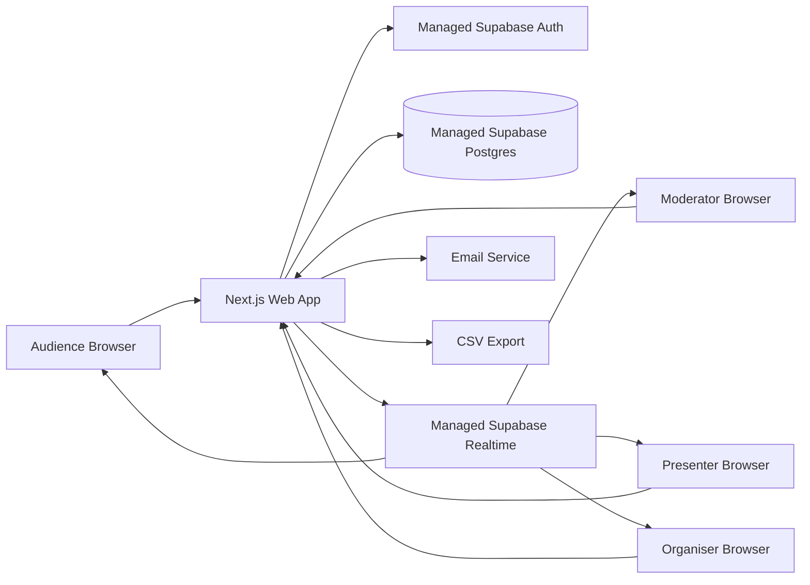
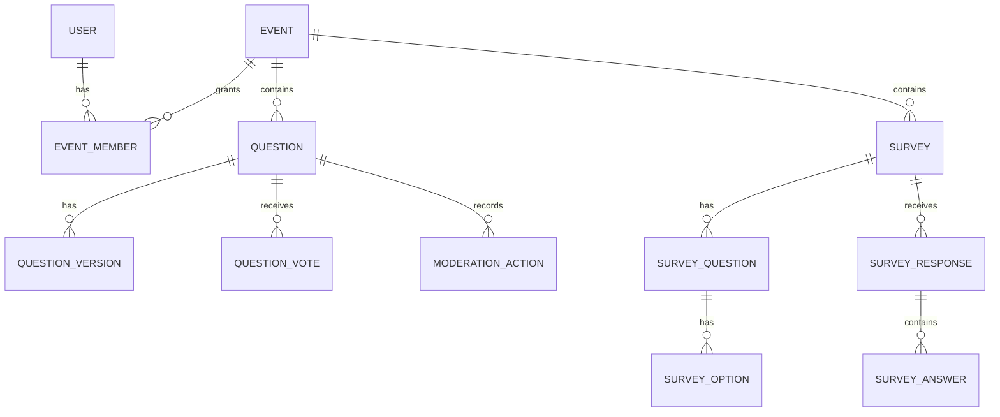

# QSB Ask - System Requirements Specification

Version: 1.0  
Date: 22 May 2026  
Status: Approved  
Source: Approved URS v1.0, PRD v1.1, SPEC v1.0

## 1. System Overview & Architecture

QSB Ask is a web application for live Q&A, moderated audience participation, surveys, presenter views, survey result presentation, and CSV exports.

The system will be built as a full-stack web application with a hosted database, authentication, and real-time data updates. The architecture should prioritise fast AI-assisted development, clear data ownership, live updates within 2 seconds, strong access control, and simple deployment.

### Recommended Architecture

### Application Areas

- Public participant area: join event, submit questions, vote, answer surveys.
- Organiser area: event dashboard, event workspace, settings, surveys, results, exports.
- Moderator area: Q&A moderation queue and question management.
- Presenter area: approved question view for speakers.
- Presentation area: projected survey result charts.

## 2. Tech Stack

### Recommended Stack For Version 1

| Layer | Recommendation | Rationale |
|---|---|---|
| Frontend and full-stack framework | Next.js 16.x App Router with React | Strong fit for a full-stack web app, server-rendered pages, route handlers, server actions, and fast Codex-assisted development. |
| Language | TypeScript | Reduces runtime mistakes and keeps data contracts explicit. |
| UI styling | Tailwind CSS with a small internal component set | Fast to build, easy to keep consistent, avoids heavy design-system overhead in v1. |
| Charts | Recharts 3.x | React-native chart library with responsive containers, bar charts, legends, tooltips, and labels suitable for survey results. |
| Backend platform | Supabase | Provides Postgres, Auth, Realtime, APIs, and database security in one managed platform. |
| Database | Supabase Postgres | Relational data fits events, roles, questions, surveys, votes, responses, and audit records. |
| Authentication | Supabase Auth email/password | Supports email/password sign-in and password reset flow for v1. |
| Real-time updates | Supabase Realtime subscriptions | Matches the 2-second live update requirement for questions, votes, moderation state, and survey responses. |
| Hosting | Coolify on QSB VPS for Next.js, managed Supabase for backend | Aligns with QSB VPS deployment rules while keeping backend development fast for v1. |
| Export | Server-side CSV generation | PRD v1.1 requires CSV only for v1. |

### Documentation Basis

- Next.js App Router supports server components, route handlers, server actions, and server-side environment variables.
- Supabase provides Auth, Postgres, Row Level Security, Realtime database subscriptions, and server-side clients for Next.js.
- Recharts provides responsive React chart components such as BarChart, PieChart, Tooltip, Legend, labels, and ResponsiveContainer.

## 3. Data Model

### Entity Relationship Overview

### Core Tables

#### users

Represents signed-in organiser, moderator, and speaker accounts. Authentication identity is managed by Supabase Auth; the application user profile stores app-level fields.

| Field | Type | Notes |
|---|---|---|
| id | uuid | Matches Supabase Auth user id. |
| email | text | Unique. |
| display_name | text | Shown in access lists and moderation history. |
| created_at | timestamp | Creation time. |

#### events

| Field | Type | Notes |
|---|---|---|
| id | uuid | Primary key. |
| name | text | Required. |
| join_code | text | Unique, non-guessable short code. |
| starts_at | timestamp | Required. |
| ends_at | timestamp | Optional. |
| time_zone | text | Defaults to organiser local time zone. |
| status | enum | draft, active, ended, archived. |
| identity_mode | enum | anonymous, name_required, name_email_required. |
| moderation_enabled | boolean | Default true. |
| question_character_limit | integer | Default 280, range 50-1000. |
| duplicate_block_enabled | boolean | Default true. |
| question_rate_limit_seconds | integer | Default 30. |
| created_by | uuid | User id. |
| created_at | timestamp | Creation time. |
| updated_at | timestamp | Last update time. |

#### event_members

| Field | Type | Notes |
|---|---|---|
| id | uuid | Primary key. |
| event_id | uuid | Event id. |
| user_id | uuid | User id. |
| role | enum | organiser, moderator, speaker. |
| invited_email | text | For pending invites. |
| status | enum | invited, active, removed. |
| created_at | timestamp | Creation time. |

#### participant_sessions

Represents an audience participant session without requiring login.

| Field | Type | Notes |
|---|---|---|
| id | uuid | Primary key. |
| event_id | uuid | Event id. |
| display_name | text | Optional, based on event identity mode. |
| email | text | Optional, based on event identity mode. |
| session_token_hash | text | Stores hash, not raw token. |
| created_at | timestamp | Creation time. |

#### questions

| Field | Type | Notes |
|---|---|---|
| id | uuid | Primary key. |
| event_id | uuid | Event id. |
| participant_session_id | uuid | Audience session id. |
| current_text | text | Current visible text. |
| status | enum | pending, live, answered, archived. |
| previous_status | enum | Used for archive restore. |
| vote_count | integer | Cached count for sorting. |
| is_edited | boolean | True when edited by moderator. |
| submitted_at | timestamp | Submission time. |
| updated_at | timestamp | Last update time. |

#### question_versions

| Field | Type | Notes |
|---|---|---|
| id | uuid | Primary key. |
| question_id | uuid | Question id. |
| version_number | integer | Starts at 1. |
| text | text | Text at this version. |
| edited_by | uuid | Null for original participant submission. |
| created_at | timestamp | Version time. |

#### question_votes

| Field | Type | Notes |
|---|---|---|
| id | uuid | Primary key. |
| question_id | uuid | Question id. |
| participant_session_id | uuid | Audience session id. |
| created_at | timestamp | Vote time. |

Unique constraint: one vote per participant session per question.

#### moderation_actions

| Field | Type | Notes |
|---|---|---|
| id | uuid | Primary key. |
| question_id | uuid | Question id. |
| event_id | uuid | Event id. |
| actor_user_id | uuid | Moderator or organiser user id. |
| action | enum | approve, dismiss, edit, archive, restore, mark_answered. |
| from_status | enum | Previous question status. |
| to_status | enum | New question status. |
| metadata | jsonb | Optional details, including edit version ids. |
| created_at | timestamp | Action time. |

#### surveys

| Field | Type | Notes |
|---|---|---|
| id | uuid | Primary key. |
| event_id | uuid | Event id. |
| title | text | Required. |
| status | enum | draft, published, closed. |
| results_visible_to_participants | boolean | Default false. |
| created_by | uuid | User id. |
| created_at | timestamp | Creation time. |
| updated_at | timestamp | Last update time. |

#### survey_questions

| Field | Type | Notes |
|---|---|---|
| id | uuid | Primary key. |
| survey_id | uuid | Survey id. |
| type | enum | multiple_choice, multiple_select, rating, open_text. |
| prompt | text | Required. |
| position | integer | Display order. |
| rating_scale | integer | 5 or 10 for rating questions. |
| created_at | timestamp | Creation time. |

#### survey_options

| Field | Type | Notes |
|---|---|---|
| id | uuid | Primary key. |
| survey_question_id | uuid | Survey question id. |
| label | text | Option label. |
| position | integer | Display order. |

#### survey_responses

| Field | Type | Notes |
|---|---|---|
| id | uuid | Primary key. |
| survey_id | uuid | Survey id. |
| participant_session_id | uuid | Participant session id. |
| submitted_at | timestamp | Submission time. |

Unique constraint: one response per participant session per survey.

#### survey_answers

| Field | Type | Notes |
|---|---|---|
| id | uuid | Primary key. |
| survey_response_id | uuid | Survey response id. |
| survey_question_id | uuid | Survey question id. |
| selected_option_ids | uuid[] | For choice questions. |
| rating_value | integer | For rating questions. |
| text_value | text | For open text questions. |

#### login_attempts

Supports the SPEC account lockout rule if managed auth does not provide the exact lockout behaviour.

| Field | Type | Notes |
|---|---|---|
| id | uuid | Primary key. |
| email | text | Lowercase email. |
| attempted_at | timestamp | Attempt time. |
| success | boolean | Attempt result. |
| ip_hash | text | Optional hashed IP for abuse detection. |

## 4. API Contracts

The application should use server actions for form-based mutations where practical and route handlers for API-style operations, CSV exports, and participant session endpoints.

### Authentication

| Method | Path | Purpose |
|---|---|---|
| POST | /auth/sign-in | Sign in organiser, moderator, or speaker. |
| POST | /auth/sign-out | End user session. |
| POST | /auth/password-reset/request | Request password reset email. |
| POST | /auth/password-reset/confirm | Confirm password reset. |

### Events

| Method | Path | Purpose |
|---|---|---|
| GET | /api/events | List events available to signed-in user. |
| POST | /api/events | Create event. |
| GET | /api/events/:eventId | Get event details. |
| PATCH | /api/events/:eventId | Update event details and settings. |
| POST | /api/events/:eventId/close | Close event. |
| POST | /api/events/:eventId/archive | Archive event. |

### Access Roles

| Method | Path | Purpose |
|---|---|---|
| GET | /api/events/:eventId/members | List event members. |
| POST | /api/events/:eventId/members | Invite organiser, moderator, or speaker. |
| DELETE | /api/events/:eventId/members/:memberId | Remove access. |

### Participant Join

| Method | Path | Purpose |
|---|---|---|
| POST | /api/join | Join event by code and create participant session. |
| GET | /api/public/events/:joinCode | Resolve public event details. |

### Questions

| Method | Path | Purpose |
|---|---|---|
| GET | /api/events/:eventId/questions | List questions by role and allowed visibility. |
| POST | /api/events/:eventId/questions | Submit participant question. |
| POST | /api/questions/:questionId/votes | Upvote approved live question. |
| DELETE | /api/questions/:questionId/votes | Remove upvote if supported later. Not required in v1 UI. |

### Moderation

| Method | Path | Purpose |
|---|---|---|
| POST | /api/questions/:questionId/approve | Move pending question to live. |
| POST | /api/questions/:questionId/dismiss | Move question to archived as dismissed. |
| PATCH | /api/questions/:questionId/edit | Edit question and write version record. |
| POST | /api/questions/:questionId/archive | Archive question. |
| POST | /api/questions/:questionId/restore | Restore question to prior state. |
| POST | /api/questions/:questionId/mark-answered | Move live question to answered. |

### Surveys

| Method | Path | Purpose |
|---|---|---|
| GET | /api/events/:eventId/surveys | List surveys for event. |
| POST | /api/events/:eventId/surveys | Create survey. |
| GET | /api/surveys/:surveyId | Get survey details. |
| PATCH | /api/surveys/:surveyId | Update survey draft or settings. |
| POST | /api/surveys/:surveyId/publish | Publish survey. |
| POST | /api/surveys/:surveyId/close | Close survey. |
| POST | /api/surveys/:surveyId/responses | Submit participant survey response. |
| GET | /api/surveys/:surveyId/results | Get chart and data results. |

### Exports

| Method | Path | Purpose |
|---|---|---|
| GET | /api/events/:eventId/export/questions.csv | Export questions and question versions. |
| GET | /api/events/:eventId/export/moderation.csv | Export moderation actions. |
| GET | /api/events/:eventId/export/survey-responses.csv | Export survey responses. |

## 5. Authentication & Authorisation

### Signed-In Users

Signed-in users are organisers, moderators, and speakers. Version 1 uses email/password authentication with password reset.

### Audience Participants

Audience participants do not need accounts. They join by code or link and receive an event-scoped participant session.

### Roles

| Role | Permissions |
|---|---|
| Organiser | Create events, manage settings, manage access, create surveys, moderate questions, view results, export records. |
| Moderator | Moderate questions, view Q&A records for assigned event. |
| Speaker | Access Presenter View for assigned event. |
| Participant | Submit questions, upvote approved live questions, answer surveys, see participant-visible results. |

### Authorisation Rules

- Organisers can only manage events they created or where they have organiser access.
- Moderators can only moderate assigned events.
- Speakers can only access Presenter View for assigned events.
- Participants can only access public event surfaces through a valid join code/session.
- Participant-visible queries must never return pending, dismissed, or archived questions.
- Survey results are hidden from participants unless the survey visibility toggle is enabled.

### Row Level Security

Supabase Row Level Security must be enabled for application tables. Policies must enforce role and event membership checks at the database layer, not only in the UI.

## 6. Real-Time Requirements

The system must update these views within 2 seconds of data changes:

- Q&A Moderation.
- Audience Q&A.
- Presenter View.
- Presentation View.
- Survey Results Dashboard.

### Recommended Real-Time Design

- Use Supabase Realtime subscriptions for question inserts, question status changes, votes, survey responses, and survey result updates.
- Subscribe by event id or survey id to avoid broadcasting unrelated data.
- Use server-side validation for all mutations. Realtime is for updates, not permission decisions.
- If realtime connection drops, show reconnect indicator and retry automatically.
- If reconnect fails for more than 30 seconds, prompt user to refresh.
- Offline moderator actions are rejected in v1.

## 7. Performance Requirements

### Version 1 Targets

| Area | Requirement |
|---|---|
| Live update latency | 95% of updates visible within 2 seconds. |
| Event participant target | Support at least 300 participants per active event for v1 pilot use. |
| Question submission | Accept at least 30 question submissions per minute per event. |
| Survey response bursts | Accept at least 300 responses within 2 minutes for a single survey. |
| Moderator action response | Approve, dismiss, archive, restore, and mark answered complete within 1 second under normal load. |
| Page usability | Audience pages load quickly on mobile and avoid heavy admin assets. |

### Scaling Notes

- Cache or denormalise vote counts on questions for fast sorting.
- Aggregate survey results server-side or through database views/functions for efficient chart rendering.
- Avoid exposing full raw response sets to participant-facing views.
- Keep presenter and presentation screens lightweight.

## 8. Security & Compliance

### Core Security Requirements

- Enforce authentication for organiser, moderator, and speaker views.
- Enforce role checks on every protected server action and route handler.
- Enable database Row Level Security.
- Store only hashed participant session tokens.
- Use HTTPS in all deployed environments.
- Store secrets only in server-side environment variables.
- Validate all incoming form and API data server-side.
- Rate-limit participant question submissions.
- Prevent duplicate voting per participant session.
- Prevent duplicate survey responses per participant session.
- Preserve moderation and edit history for accountability.

### Account Security

- Password reset must use time-limited reset links.
- Five failed sign-in attempts within 15 minutes locks the account for 30 minutes.
- If Supabase Auth cannot enforce the exact lockout policy directly, implement an application-level guard before sign-in attempts.

### Data Privacy

- Anonymous participants should appear as Anonymous in public and exported views, with only a per-session identifier for audit.
- Name/email collection only applies when the event identity mode requires it.
- Open text survey responses may contain sensitive information and must follow the same access controls as other event records.

### Auditability

The system must retain:

- Original question text.
- Edited question versions.
- Moderator action history.
- Survey responses.
- Exportable event records.

## 9. Infrastructure & Deployment

### Recommended Environments

| Environment | Purpose |
|---|---|
| Local | Codex-assisted development and local testing. |
| Preview | Coolify preview or staging deployment for user review and UAT. |
| Production | Coolify-managed production deployment for actual events. |

### Hosting

Version 1 will use a hybrid deployment model:

- The Next.js application is deployed through Coolify on the QSB VPS.
- Supabase remains a managed backend service for Auth, Postgres, Realtime, and database policies.
- Public users access the application through a QSB-controlled domain.
- Supabase project URLs remain server/client configuration values and are not the public product domain.

Recommended public domain:

- `https://ask.qsbportal.com.my`

Coolify requirements:

- The app must be created as a Coolify resource, visible in the Coolify dashboard.
- The app must not be deployed as an ad hoc long-running Docker Compose service outside Coolify.
- The app container should expose the Next.js runtime port to Coolify/Traefik.
- Required environment variables must be configured in Coolify, not hardcoded in source.
- Deployment verification must check the Coolify resource, running container, internal route, public HTTPS route, and application health route.

- Next.js app hosted on QSB VPS through Coolify.
- Supabase project hosts Postgres, Auth, Realtime, and database policies.
- Environment variables stored in Coolify project settings and local `.env` for development.

### Backups

- Supabase database backups must be enabled before production use.
- Exports are not a replacement for database backup.

### Email

Version 1 requires email for:

- Password reset links.
- Event role invitations.

Recommended initial path:

- Use Supabase Auth email for password reset.
- Use a transactional email provider for role invitations if Supabase invite flows do not cover the required experience cleanly.

## 10. Dependencies & Third-Party Services

| Dependency | Purpose |
|---|---|
| Next.js | Full-stack web application framework. |
| React | UI rendering. |
| TypeScript | Type safety. |
| Supabase | Auth, Postgres, Realtime, database APIs. |
| Recharts | Survey result charts. |
| Coolify | QSB VPS application deployment, domain routing, container lifecycle, and environment variable management. |
| Transactional email provider | Role invitations if needed. |

## 11. Implementation Constraints

- Build from SPEC and SRS only after both are approved.
- Keep CSV export as v1; Excel export remains P1.
- Do not add quizzes, word clouds, AI generation, payment plans, or advanced analytics in v1.
- Do not rely on client-side checks alone for moderation, role access, or visibility rules.
- Do not show pending, dismissed, or archived questions to participants or speakers.
- Keep the audience experience mobile-first.

## 12. Approved Decisions

The following SRS decisions are approved:

1. Version 1 uses the hybrid stack: Next.js, TypeScript, Tailwind CSS, Supabase, Recharts, and Coolify on QSB VPS.
2. Version 1 target capacity is 300 participants per active event.
3. Managed Supabase is acceptable for Version 1 Auth, Postgres, Realtime, and data storage.
4. Transactional email provider may be selected during implementation if Supabase Auth email does not cover all invite needs.
5. Formal event record retention duration may be defined before production launch.
